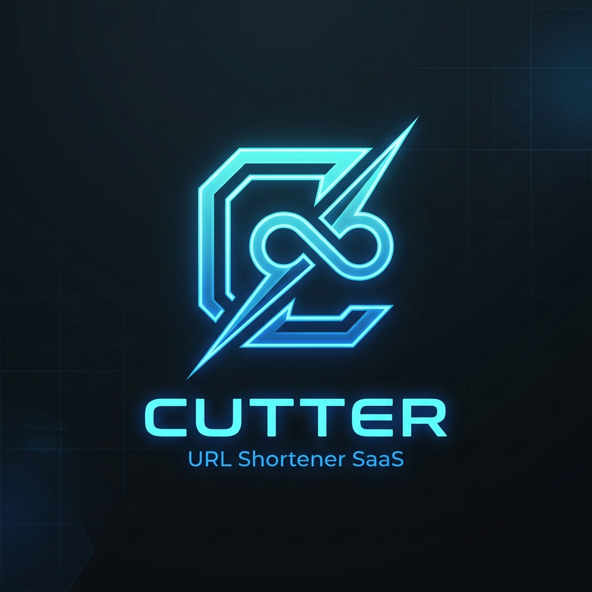

# ✂️ Cutter — URL Shortener & Analytics SaaS

<p align="center">
  
</p>

**Cutter** is a high-performance URL shortener and real-time link analytics platform built with modern web technologies and a sleek liquid glass dark theme design.

---

## ✨ Features

- 💎 **Liquid Glass UI**: Glassmorphism aesthetic featuring HSL dark mode, custom reflections, and modern typography (Inter & Instrument Serif).
- ⚡ **Instant URL Shortening**: Custom short code creation, vector QR code generator, and one-click copy to clipboard.
- 📊 **Real-time Analytics Dashboard**: Monitor link clicks, active shortened URLs, traffic sources, and geographic metrics.
- 🔑 **Supabase Authentication**: Integrated Email/Password registration & sign-in, and Google OAuth support.
- 🗄️ **Supabase Database & Offline Fallback**: Persistent Supabase database operations with seamless client-side local storage backup.
- 🎨 **Smooth Scroll Animations**: Parallax dashboard effects and scroll-driven word-by-word opacity reveals powered by Framer Motion.

---

## 🛠️ Tech Stack

- **Frontend**: React 18, Vite, TypeScript
- **Styling**: Tailwind CSS v3, Custom CSS Tokens, Glassmorphism
- **Animations**: Framer Motion, Canvas Confetti
- **Backend & DB**: Supabase JS Client (`@supabase/supabase-js`)
- **Icons & QR**: Lucide React, QRCode SVG

---

## 🚀 Getting Started

### Prerequisites

- Node.js (v18 or higher)
- npm or yarn

### Installation

1. **Clone the repository**:
   ```bash
   git clone https://github.com/sh4dabexe/Cutter.git
   cd Cutter
   ```

2. **Install dependencies**:
   ```bash
   npm install
   ```

3. **Configure environment variables**:
   Create a `.env` file in the root directory:
   ```env
   VITE_SUPABASE_URL=https://your-supabase-url.supabase.co
   VITE_SUPABASE_ANON_KEY=your-supabase-anon-key
   ```

4. **Run the development server**:
   ```bash
   npm run dev
   ```
   Open `http://localhost:5173` in your browser.

---

## 🗄️ Database Setup (Supabase SQL)

Run the following schema in your Supabase SQL Editor to set up the `urls` and `url_analytics` tables:

```sql
CREATE TABLE IF NOT EXISTS public.urls (
  id UUID DEFAULT gen_random_uuid() PRIMARY KEY,
  short_code VARCHAR(12) UNIQUE NOT NULL,
  original_url TEXT NOT NULL,
  title VARCHAR(255),
  clicks INT DEFAULT 0,
  user_id UUID REFERENCES auth.users(id) ON DELETE CASCADE,
  created_at TIMESTAMP WITH TIME ZONE DEFAULT timezone('utc'::text, now()) NOT NULL
);

CREATE TABLE IF NOT EXISTS public.url_analytics (
  id UUID DEFAULT gen_random_uuid() PRIMARY KEY,
  url_id UUID REFERENCES public.urls(id) ON DELETE CASCADE NOT NULL,
  clicked_at TIMESTAMP WITH TIME ZONE DEFAULT timezone('utc'::text, now()) NOT NULL,
  referrer TEXT DEFAULT 'Direct',
  user_agent TEXT,
  country VARCHAR(50) DEFAULT 'Global'
);
```

---

## 🔐 Google OAuth Setup Guide

To enable "Continue with Google" sign-in, configure both **Google Cloud Console** and **Supabase Dashboard**:

### 1. Google Cloud Console Setup
1. Open [Google Cloud Console](https://console.cloud.google.com/) and create or select your project.
2. Navigate to **APIs & Services > OAuth consent screen**:
   - Choose **External** and fill in required fields (App Name, User Support Email, Developer Email).
   - If your app status is **Testing**, go to the **Test users** tab and add your personal Google email address.
3. Navigate to **APIs & Services > Credentials**:
   - Click **Create Credentials > OAuth Client ID**.
   - Application Type: **Web application**.
   - **Authorized JavaScript origins**:
     - `https://<YOUR-PROJECT-REF>.supabase.co`
   - **Authorized redirect URIs**:
     - `https://<YOUR-PROJECT-REF>.supabase.co/auth/v1/callback`
   - Click **Create** and copy the **Client ID** and **Client Secret**.

### 2. Supabase Dashboard Setup
1. Open your [Supabase Dashboard](https://supabase.com/dashboard).
2. Go to **Authentication > Providers > Google**:
   - Toggle **Enable Google provider** to **ON**.
   - Paste your **Client ID** and **Client Secret** obtained from Google Cloud Console.
   - Click **Save**.
3. Go to **Authentication > URL Configuration**:
   - Set **Site URL** to `http://localhost:5173` (or your production deployment domain).
   - In **Redirect URLs**, add:
     - `http://localhost:5173/**`
     - `http://localhost:3000/**`
     - `https://your-domain.vercel.app/**` (production)
   - Click **Save**.

### 3. Common Troubleshooting Steps
- **`DNS_PROBE_FINISHED_NXDOMAIN` / Failed to fetch**:
  Free-tier Supabase projects automatically pause after 7 days of inactivity. Go to your Supabase Dashboard and click **"Restore project" / "Unpause"**, or update `.env` if you have a new project URL.
- **`Unsupported provider: provider is not enabled`**:
  You must enable the Google provider in Supabase Dashboard (Authentication > Providers > Google) and click Save.
- **`redirect_uri_mismatch` (Google Error 400)**:
  Ensure the Authorized Redirect URI in Google Cloud Console is exactly `https://<YOUR-PROJECT-REF>.supabase.co/auth/v1/callback`.
- **`Access blocked: 403 access_denied`**:
  If your Google Cloud app is in "Testing" mode, only accounts listed under **Test users** in the OAuth Consent Screen can sign in. Add your email address or publish the app.

---

## 📜 License

MIT License © 2026 Cutter SaaS Inc.
